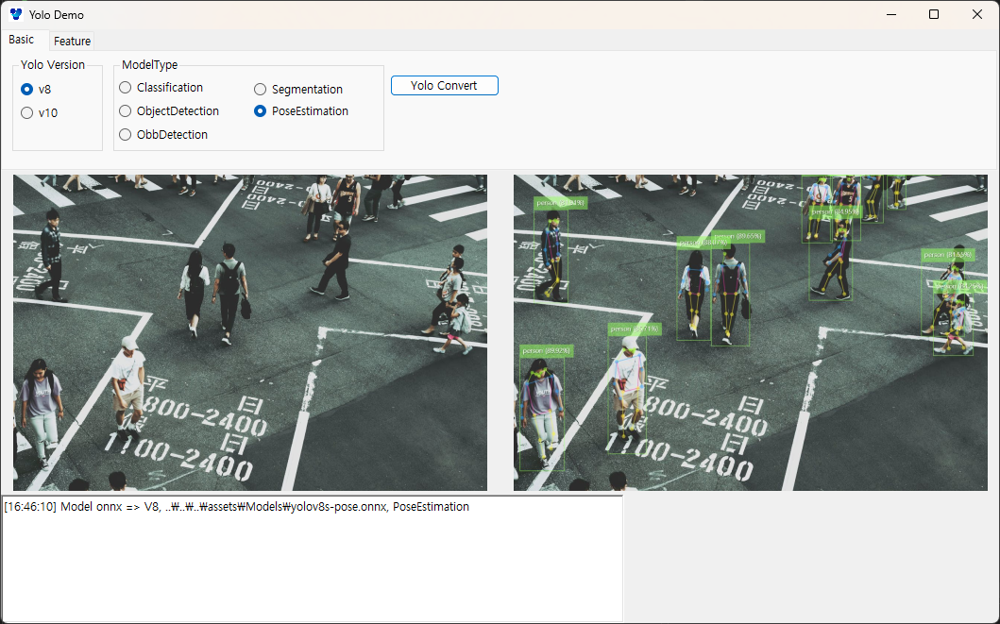

# Yolo Demo

## Test tool for Yolo v8/10
### Yolo C# refered https://github.com/NickSwardh/YoloDotNet

## Feature
- Video inference added
    - Added video feature but there happenning error while find outpur dir
    - Not yet solved
    - Fixed issue. Console.xxx API causes problems. Guess this is winform and console API looks causes issue.
    - Yolo read video file and removes audio data and converts video to png and looks sum all of png???

## TODO
- Cam streaming

### Development tool
- Visual Studio 2022
- C#
- Winform
- Package
    - YoloDotNet
    - OpenCVSharp4
    - Microsoft.ML.OnnxRuntime
    - SixLabors.ImageShart

